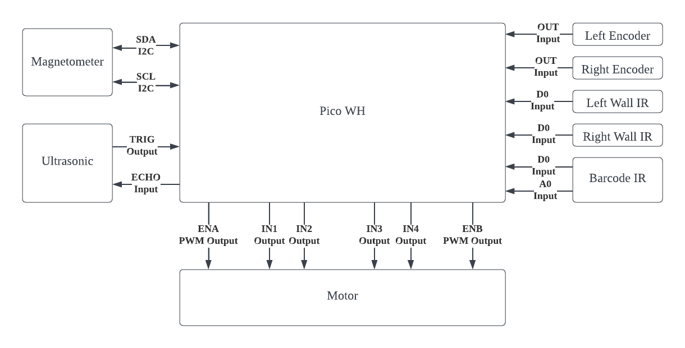

# INF2003_Embedded_System

## Getting started
1) Clone [PICO SDK](https://github.com/raspberrypi/pico-sdk)
2) After cloning, add the directory path to PICO_SDK_PATH
3) Clone this repository, if CMake is installed on the computer, upon changes to CMakeLists.txt, the build folder should be regenerated
4) Change directory to build directory using `cd build`
5) Run `make` in the build directory to generate binary files to drag into your raspberry pi pico

## Connections
| Component               | Component Pin | PICO GP | IN/OUT (FUNCTION)   |
|-------------------------|---------------|---------|---------------------|
| Motor                   | ENB           | 0       | OUT (PWM)           |
|                         | IN3           | 1       | OUT                 |
|                         | IN4           | 2       | OUT                 |
|                         | IN1           | 3       | OUT                 |
|                         | IN2           | 4       | OUT                 |
|                         | ENA           | 5       | OUT (PWM)           |
| Ultrasonic              | TRIG          | 6       | OUT                 |
|                         | ECHO          | 7       | IN                  |
| Left Encoder            | OUT           | 14      | IN                  |
| Right Encoder           | OUT           | 15      | IN                  |
| Left Wall IR            | D0            | 16      | IN                  |
| Right Wall IR           | D0            | 17      | IN                  |
| GY-511 (Magnetometer)   | SDA           | 18      | GPIO_FUNC_I2C       |
|                         | SCL           | 19      | GPIO_FUNC_I2C       |
| Barcode IR              | A0            | 26      | IN                  |

## Block Diagram

## Contributions
| Name       | Component                                                                       |
|------------|---------------------------------------------------------------------------------|
| Lee Kee    | [Encoder](driver/encoder)                                                       |
|            | [Wi-Fi](driver/wifi)                                                            |
|            | [Drive through and detect barcode-decode and send to WiFi](partial_integration) |
| Ani        | [Motor](driver/motor)                                                           |
|            | [Straight Path](partial_integration)                                            |
|            | [Right/left-angle turn](partial_integration)                                    |
|            | [Documentation](images)                                                         |
| Mun Hong   | [Ultrasonic](driver/ultrasonic)                                                 |
|            | [Magnetometer](driver/magnetometer)                                             |
|            | [Drive through and detect obstacles and Stop](partial_integration)              |
| Xavier     | [Infrared](driver/irline)                                                       |
|            | [Barcode](driver/barcode)                                                       |
|            | [Drive through and detect barcode-decode and send to WiFi](partial_integration) |
| Joo Wee    | Set-up of project structure                                                     |
|            | [Maze Solving](driver/maze_solving)                                             |
|            | [Right/left-angle turn](partial_integration)                                    |
|            | [Documentation](images)                                                         |

## Quick Links
### Driver
  - [Barcode](driver/barcode)
  - [Encoder](driver/encoder)
  - [Mapping](driver/maze_solving)
  - [Infrared](driver/irline)
  - [Magnetometer](driver/magnetometer)
  - [Motor](driver/motor)
  - [Ultrasonic](driver/ultrasonic)
  - [Wi-Fi](driver/wifi)

### Partial Integration
  - [Partial Integration](partial_integration)

### Flow Chart & Block Diagrams
  - [Images](images)
