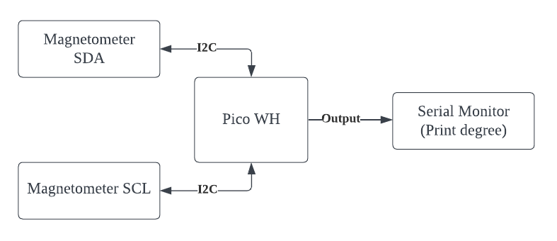
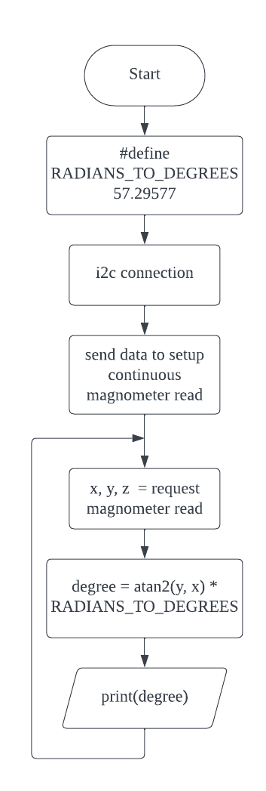

# Magnetometer

## Understanding Magnetometer
| Component Pin | Function                            |
|---------------|-------------------------------------|
| SDA           | Data line to send/receive data      |
| SCL           | Clock line to ensure I2C is in sync |

## Block Diagram

## Flowchart
### Decode Barcode Char

