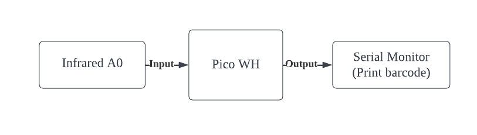
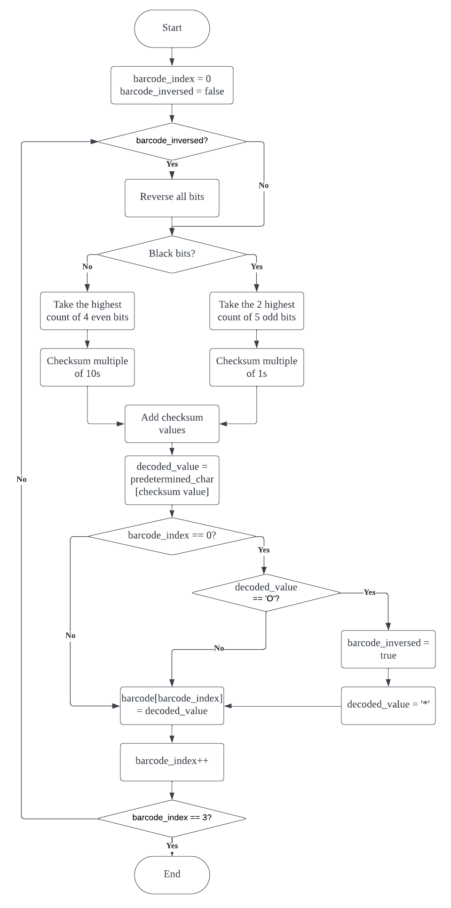
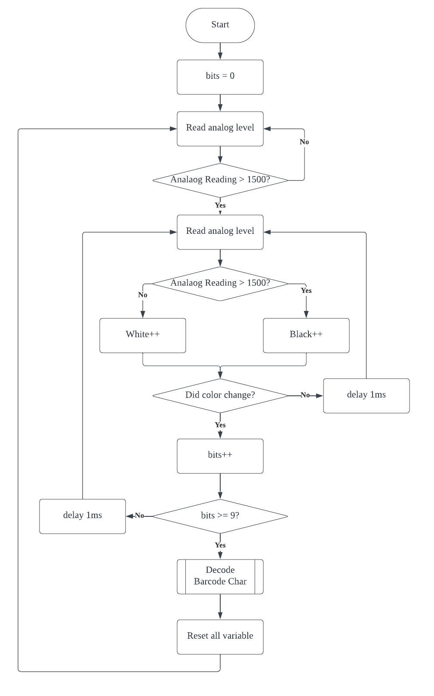

# Barcode

## Understanding Infrared Sensor
Component Pin | Function                                                            |
|-------------|---------------------------------------------------------------------|
| D0          | Turns output signal to HIGH when it doesn’t receive enough infrared |

## Block Diagram

## Flowchart
### Decode Barcode Char

### Determine bits
  - Uses [Decode Barcode Char](#decode-barcode-char)

