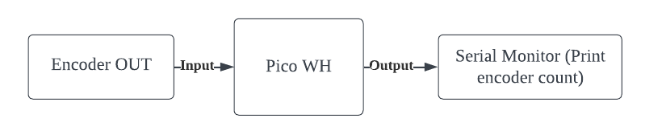
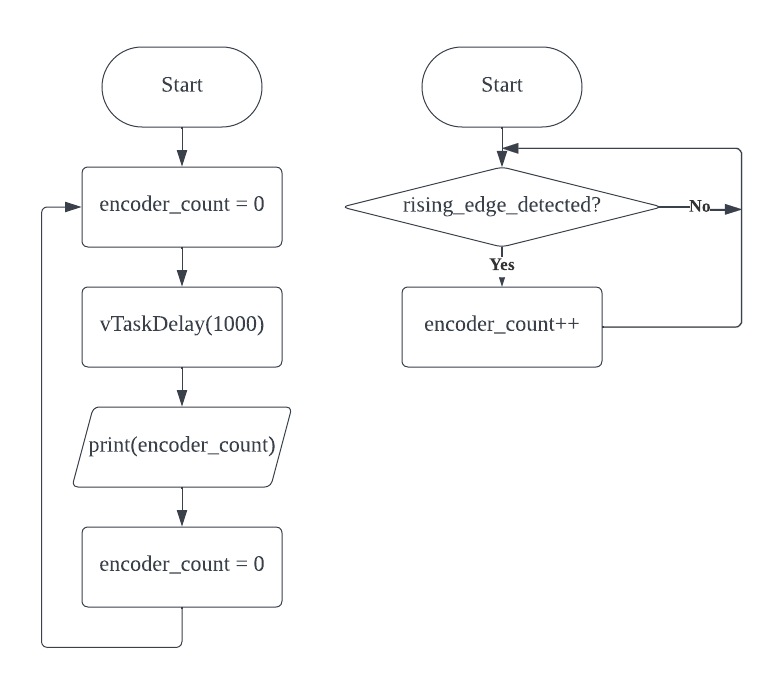

# Encoder

## Understanding Encoder
Component Pin | Function                                                                    |
|-------------|-----------------------------------------------------------------------------|
| OUT         | Turns output signal to LOW when the infrared between the encoder is blocked |

## Block Diagram

## Flowchart
These 2 functions runs in parallel

