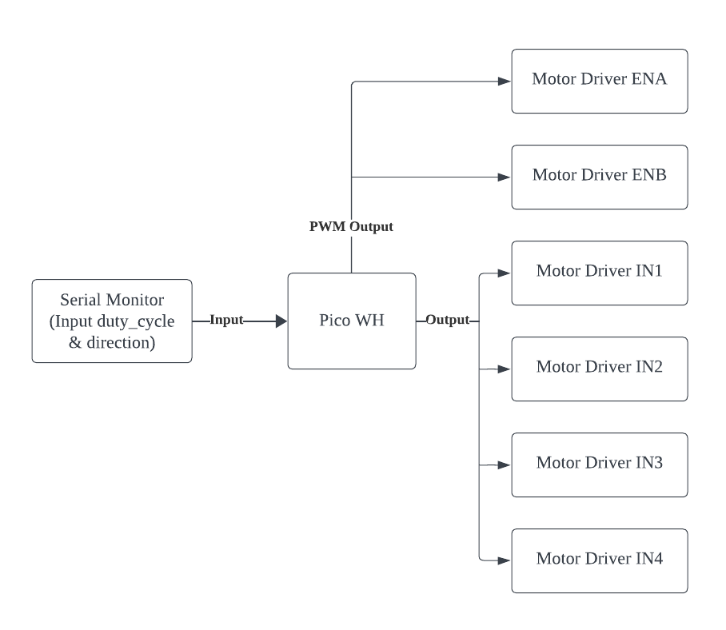
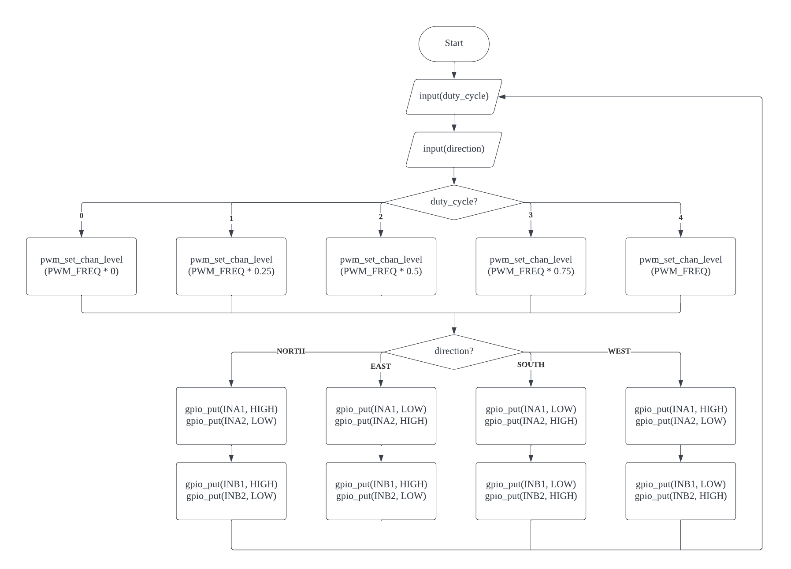

# Motor Driver

## Understanding Motor Driver
| Component Pin | Function                                                                                |
|---------------|-----------------------------------------------------------------------------------------|
| ENA           | Takes in PWM to determine speed of motor A                                              |
| IN1 & IN2     | Takes in input of LOW/HIGH with accordance to IN1 & IN2 to control direction of motor A |
| IN3 & IN4     | Takes in input of LOW/HIGH with accordance to IN3 & IN4 to control direction of motor B |
| ENB           | Takes in PWM to determine speed of motor B                                              |

## Block Diagram

## Flowchart

