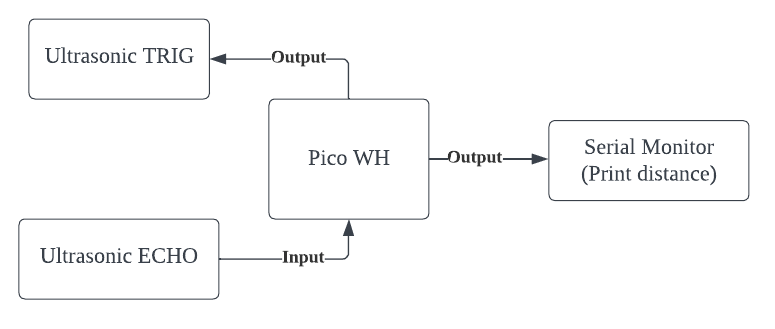
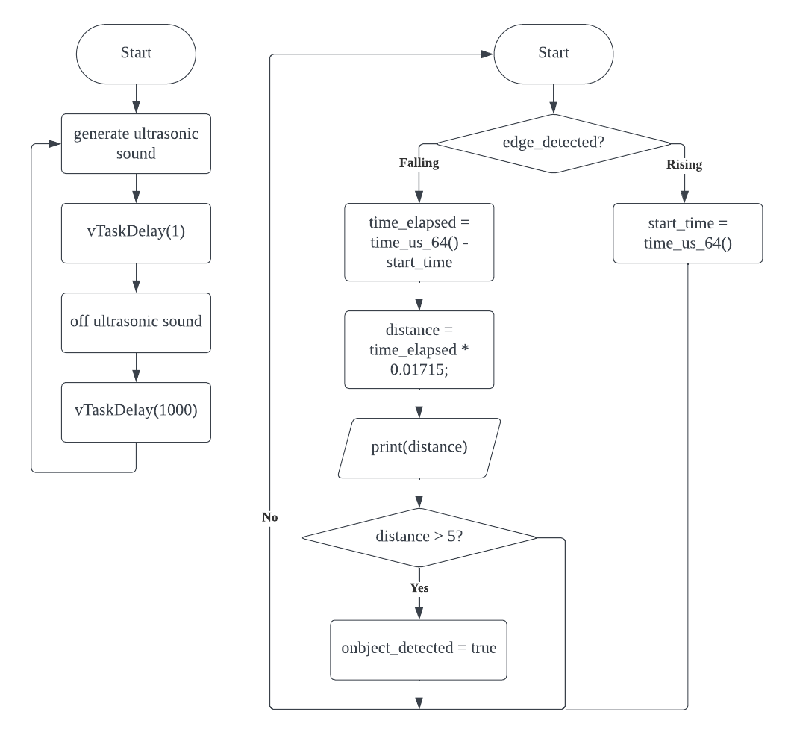

# Ultrasonic

## Understanding Ultrasonic
| Component Pin | Function                                                    |
|---------------|-------------------------------------------------------------|
| TRIG          | Upon receiving input HIGH, create an ultrasonic sound       |
| ECHO          | Upon receiving ultrasonic sound, turns output signal to LOW |

## Block Diagram

## Flowchart

