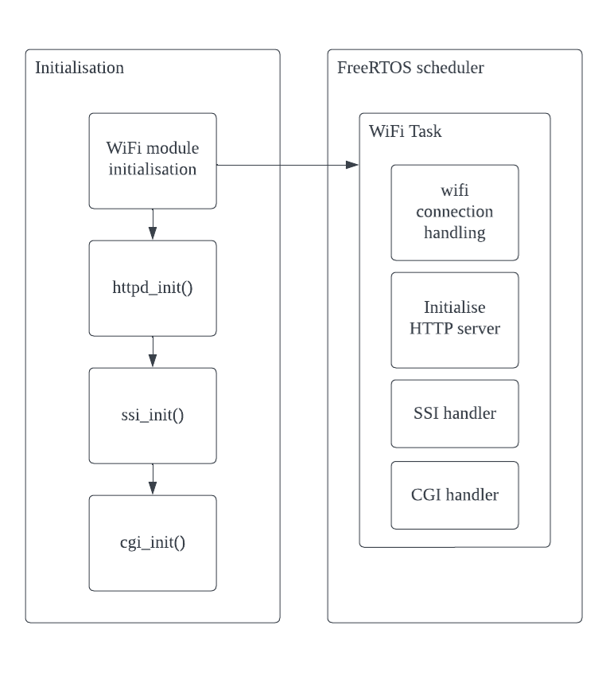
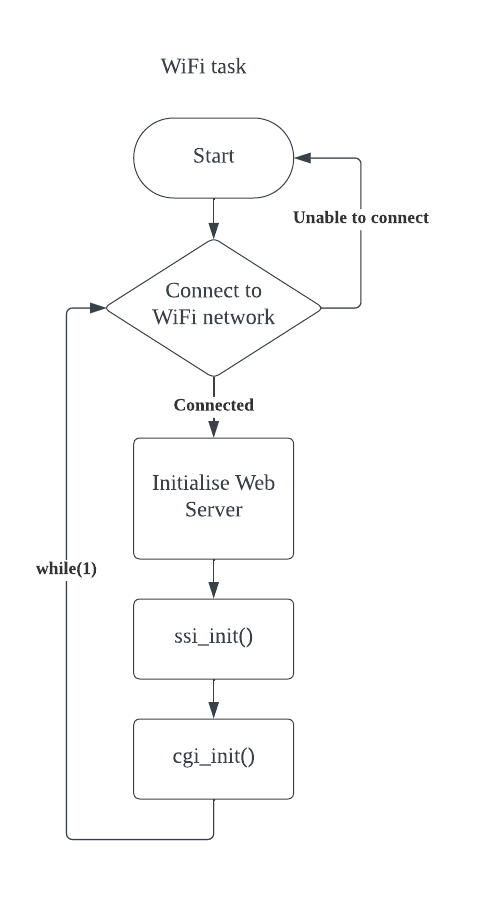
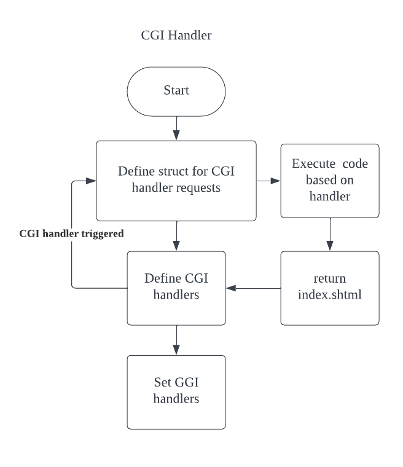
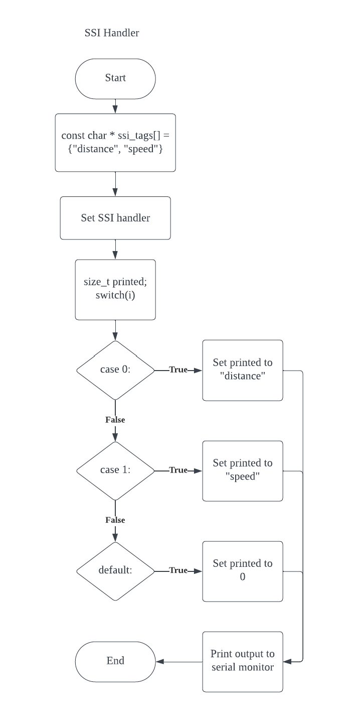

# Wifi/Web Server

## Accessing the web server

1. Replace the WiFi credentials here: [CMakeLists.txt](../../driver/wifi/CMakeLists.txt)
2. Upon startup, check for the IP Address assigned to the Pico W
3. Enter the ip address into any web browser to access the html page

## Block Diagram

## Flowcharts
SSI and CGI are initialised in the wifi task

