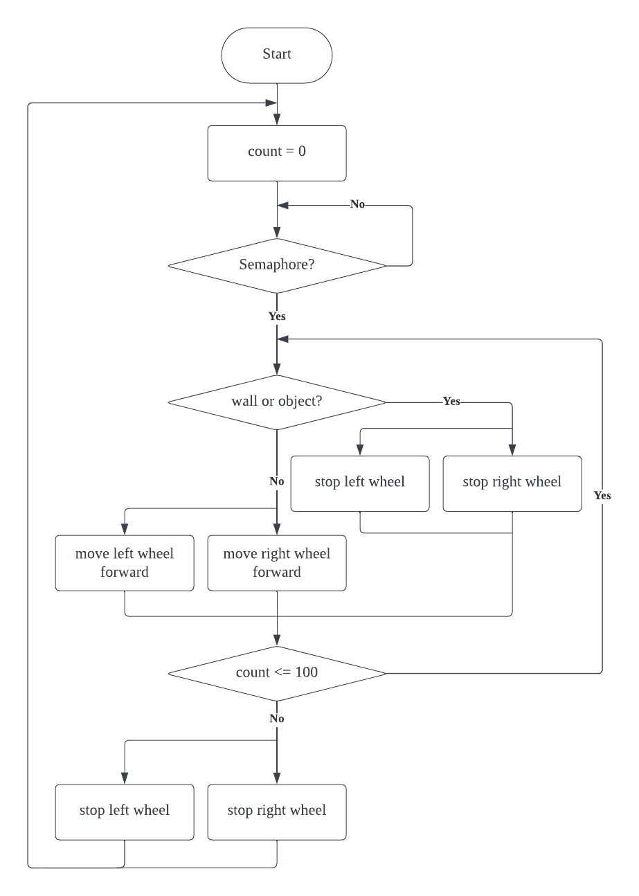
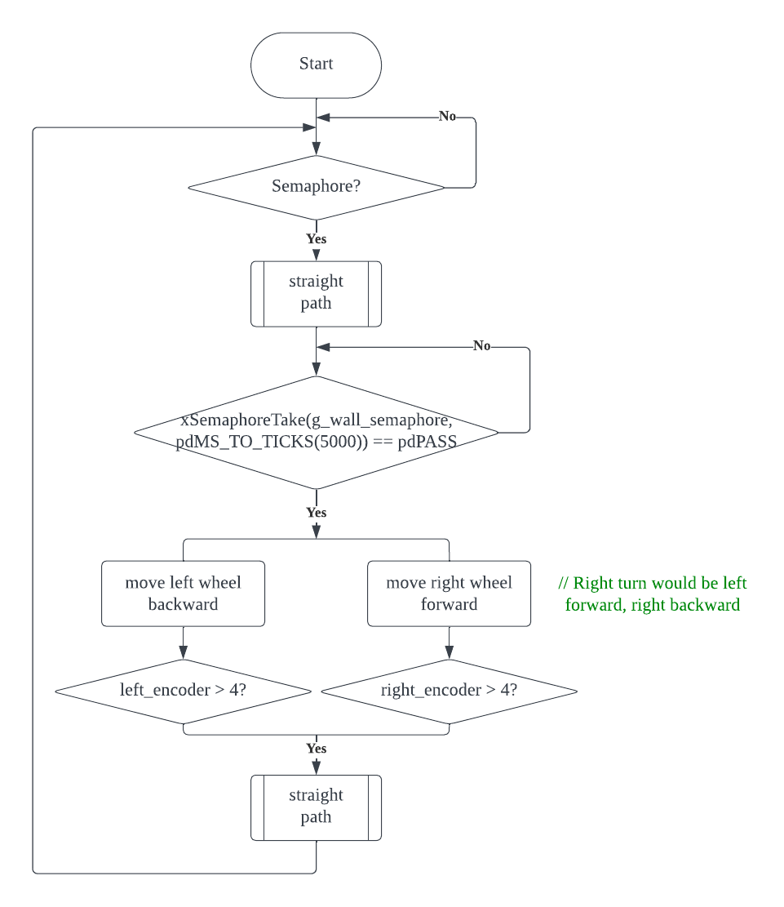
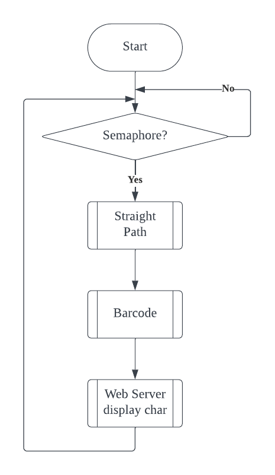
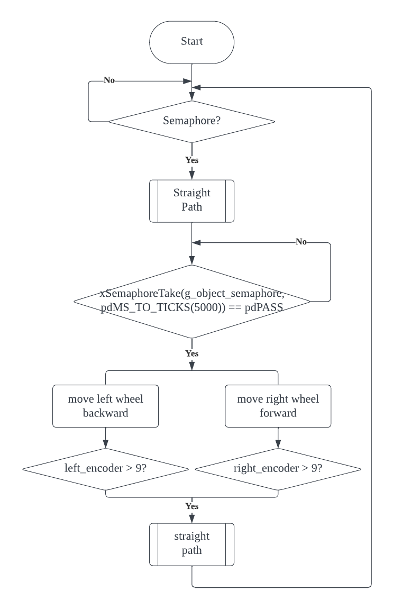

# Partial Integration
- [Straight Path](#straight-path-flowchart)
- [Right/left-angle turn](#rightleft-angle-turn-flowchart)
- [Drive through and detect barcode-decode and send to WiFi](#drive-through-and-detect-barcode-decode-and-send-to-wifi-flowchart)
- [Drive through and detect obstacles and Stop](#drive-through-and-detect-obstacles-and-stop-flowchart)

## Straight Path Flowchart
  - Uses [Infrared Interrupt](../partial_integration_include#left-right-front-infrared-interrupt-flowchart) | [Encoder Interrupt](../driver/encoder/README.md#flowchart)

## Right/left-angle turn Flowchart
  - Uses [Straight Path](#straight-path-flowchart) | [Infrared Interrupt](../partial_integration_include#left-right-front-infrared-interrupt-flowchart) | [Encoder Interrupt](../driver/encoder/README.md#flowchart)

## Drive through and detect barcode-decode and send to WiFi Flowchart
  - Uses [Straight Path](#straight-path-flowchart) | [Infrared Interrupt](../partial_integration_include#left-right-front-infrared-interrupt-flowchart) | [Encoder Interrupt](../driver/encoder/README.md#flowchart) | [Wi-Fi](../driver/wifi/README.md) | [Barcode](../driver/barcode/README.md#flowchart)
    

## Drive through and detect obstacles and Stop flowchart
  - Uses [Straight Path](#straight-path-flowchart) | [Ultrasonic Interrupt](../driver/ultrasonic/README.md#flowchart)

